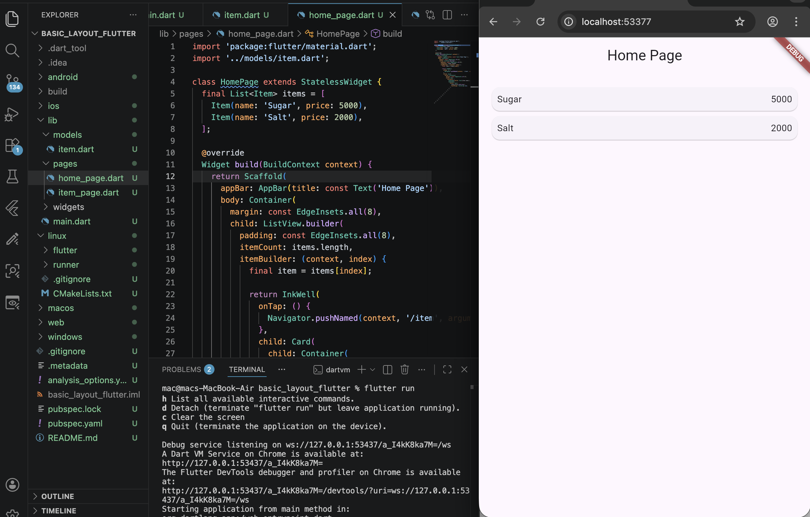
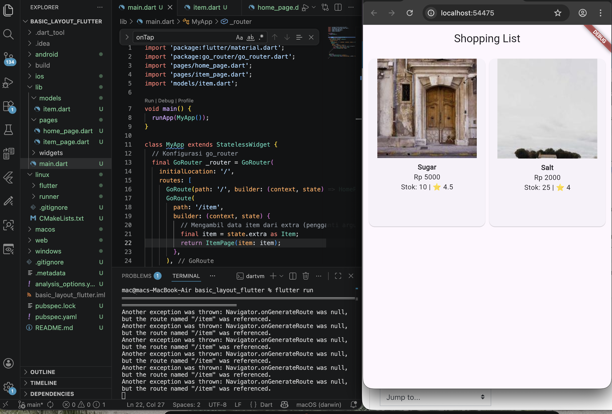

# 🛒 Belanja App - Praktikum Navigasi & Rute

Tugas praktikum Flutter untuk mata kuliah Pemrograman Mobile. Aplikasi ini mendemonstrasikan implementasi navigasi antar halaman, pengelolaan data model, dan penggunaan library pihak ketiga untuk routing.

## 🚀 Fitur Utama
*   **Daftar Produk (GridView):** Menampilkan data produk (Gula, Garam, dll) dalam bentuk grid yang rapi.
*   **Detail Produk:** Menampilkan informasi lengkap termasuk Nama, Harga, Stok, dan Rating.
*   **Hero Animation:** Animasi transisi gambar yang mulus saat berpindah dari halaman utama ke halaman detail.
*   **GoRouter:** Implementasi navigasi modern menggunakan package `go_router` untuk routing yang lebih deklaratif.
*   **Data Modeling:** Menggunakan class `Item` untuk manajemen atribut data yang terstruktur.

## 📸 

<video src="images/1-2.mov" width="300" controls></video>
[Lihat Video Praktikum 5](images/1-2.mov)

<video src="images/2-2.mov" width="300" controls></video>
[Lihat Video Tugas Praktikum](images/2-2.mov)

## 📝 
*   **Nama:** Dina Mei Lestari
*   **NIM:** 244107060105
*   **Kelas:** SIB 2F
